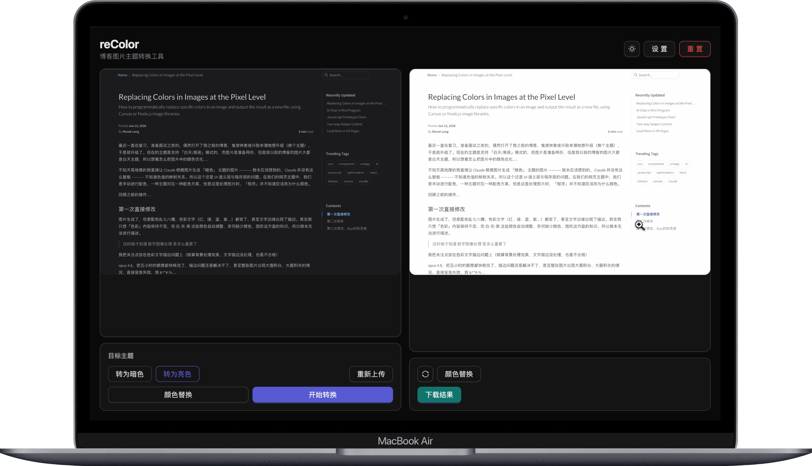

# reColor



博客图片明暗主题转换工具。将亮色截图转为暗色配色（或反向），同时支持任意颜色精确替换与主色分析。基于 Sharp，无需 ImageMagick 等系统依赖。

---

## 快速启动（Web 界面）

```bash
npm install
npm run dev
```

浏览器打开 `http://localhost:5173`，后端 API 监听 `http://localhost:3001`。

生产部署：

```bash
npm run build   # 构建前端到 client/dist
npm start       # 启动服务，默认端口 3001
```

---

## Web 界面使用

### 1. 上传图片

将图片拖入左侧区域，或点击区域选择文件（支持 PNG / JPG / WebP 等常见格式）。

### 2. 主题转换

选择目标主题（**转为暗色** 或 **转为亮色**），点击 **开始转换**。

转换算法：色相旋转 180° + 明度反转 + 色阶校正，保留原图的色彩关系，适合代码截图、UI 配色图等场景。

### 3. 颜色替换

点击 **颜色替换** 打开替换面板，可添加多个「原色 → 目标色」对，每对支持设置容差（Fuzz）以匹配相近色。常见用途：将背景白 `#FFFFFF` 换成透明色前的底色、修正抗锯齿边缘杂色等。

右列结果区也有独立的颜色替换入口，可对转换结果二次处理。

### 4. 下载

处理完成后点击 **下载** 保存结果图片。

### 其他操作

| 操作 | 说明 |
|------|------|
| 重新上传 | 替换当前图片，保留操作设置 |
| 重置 | 清空图片和结果，回到初始状态 |
| 同步按钮（↺） | 对结果图重新应用设置面板中的配色方案 |
| 点击图片 | 全屏预览 |

### 设置面板

点击 **设置** 可预置常用的颜色替换方案，分「转为暗色」和「转为亮色」两组，每次转换后自动应用。

---

## CLI 使用

适合批量处理或脚本集成，不启动服务器，直接操作本地文件。

```bash
node index.js <文件名> <dark|light>
```

文件名可省略路径（默认从 `images/` 目录查找）和扩展名（默认 `.png`）。

### 主题转换

```bash
# 将 images/screenshot.png 转换为暗色版本
node index.js screenshot dark

# 转换为亮色版本
node index.js screenshot light
```

转换后原文件重命名为 `screenshot-light.png`（标注来源主题），新文件保存为 `screenshot-dark.png`。

### 颜色分析

统计图片出现频率最高的 15 种颜色及占比：

```bash
node index.js --analyze screenshot
```

输出示例：

```
📊 screenshot.png 颜色分析 (前 15 名):

  像素数      占比    Hex
  ───────────────────────
    124800   48.0%   #FFFFFF
     62400   24.0%   #1E1E1E
     ...
```

### 颜色替换

```bash
node index.js --replace <文件名> <原色>/<目标色> [<原色>/<目标色> ...]
```

颜色格式为 `#RRGGBB`，可在颜色后附加 `:<容差%>`（默认 8%）：

```bash
# 将白色背景替换为深色
node index.js --replace screenshot #FFFFFF/#1E1E1E

# 多对替换，第二对使用 12% 容差
node index.js --replace screenshot #FFFFFF/#1E1E1E #F5F5F5/#2D2D2D:12
```

替换操作**直接覆盖原文件**，建议先备份或使用 Web 界面预览。

> **注意**：颜色替换目前基于简单的欧氏距离匹配，在抗锯齿边缘、渐变区域等场景下效果有限，容差参数需要手动调试。受限于数字图像处理知识，复杂情况下替换结果可能不够精确。

---

## 技术栈

- **后端**：Node.js + Express + Sharp
- **前端**：React 18 + Ant Design + Zustand + Vite
